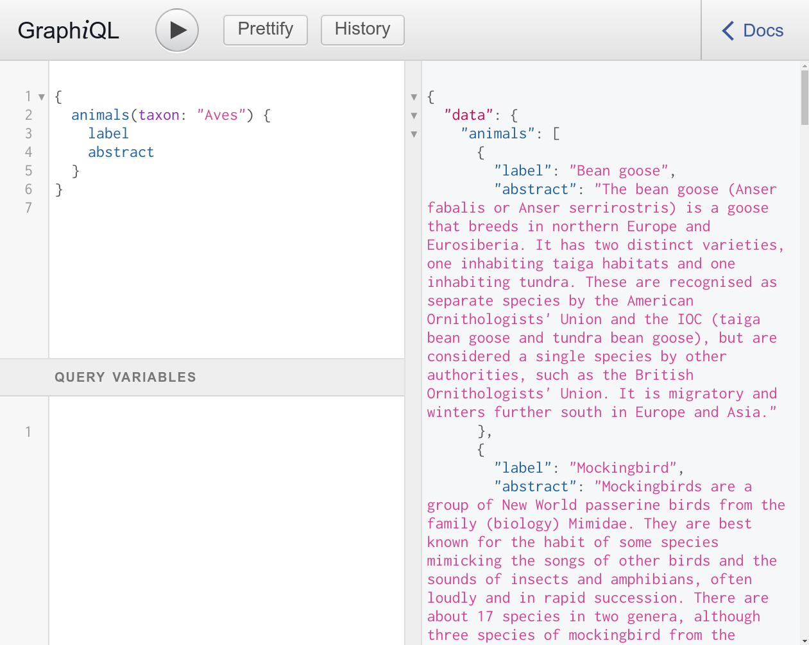

# SPARQL + GraphQL + Python

Playing with SPARQL and GraphQL in Python.
In a stand-alone version one could use a databse stored in GraphDB (`docker pull ontotext/graphdb:10.6.3`).
Here, for the sake of simplicity, I'm using the DBPedia SPARQL API.

# What it does

Expose a GraphQL API using Graphene library for Python with Flask and send queries to the database using SPARQLWrapper.

# Running it

```
python3 -m venv venv
source venv/bin/activate
pip install -r requirements.txt
DEBUG=1 flask run
```

The API listens at `http://127.0.0.1:8000`

